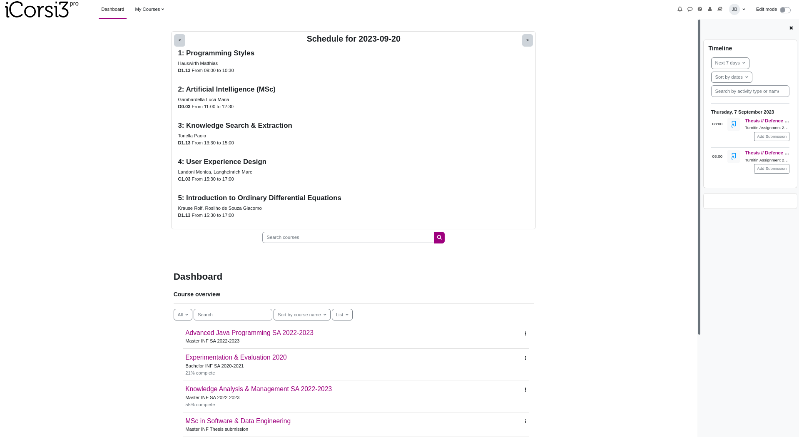

# i3Corsipro

Customize iCorsi3:

- Remove useless quick links at the top, news and the footer
- Upgrade logo to show it's the **pro** version of iCorsi
- [Integration to display courses schedules

## How to install

0. Ensure that "_Editor preferences_ > _Text editor_" in the user preferences
   is set to "_Plain text_"
1. From the homepage, click "_Customise this page_"
2. On the right side, select "_Add block_" and then "_HTML_"
3. You will find a new block on the right side of the page,
   probably called "_(new HTML block)_", click on the gear icon
   and select "_Configure (new HTML block)_"
4. Paste the content of [icorsi.html](./icorsi.html) into the "_Content_"
   text field
5. Click "_Save changes_"
6. Click "_Stop customising this page_" once you're back in the main page

## Preview

